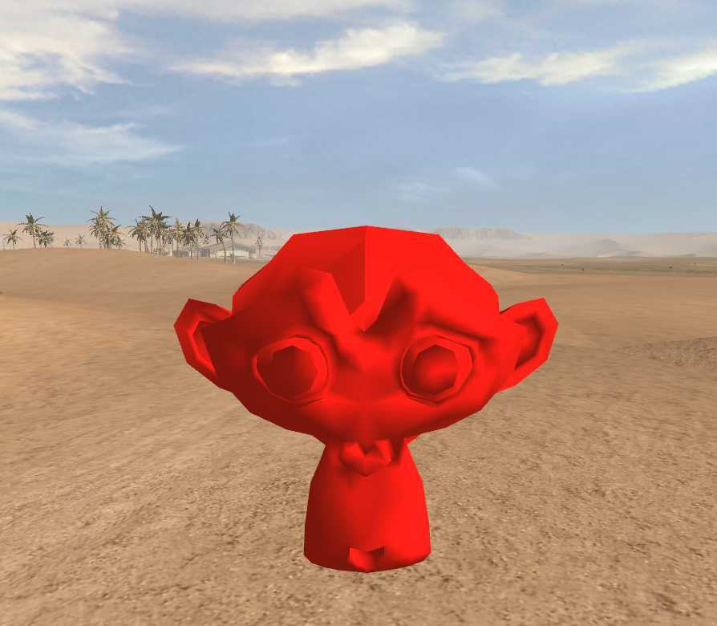

[](https://github.com/FlashX64/blender-ls3d-tools/releases)
# Blender LS3D Tools
A Blender addon that adds support for LS3D Engine v5.559 formats.

## Features
*   4DS import/export
*   Standard mesh, billboard mesh creation
*   Sectors, portals, occluder creation
*   Lens flares creation
*   Complete LS3D material settings support
*   Complete LS3D object settings support
*   Proper UV mapping export

## Limitations
*   Armatures, skins and morphs cannot be exported yet

## Installation
1. Put `ls3d_tools` folder in the addons folder depending on your operating system.
    * Windows: `%USERPROFILE%\AppData\Roaming\Blender Foundation\Blender\%BLENDERVERSION%\scripts\addons`
    * Linux: `$HOME/.config/blender/%BLENDERVERSION%/scripts/addons`
    * macOS: `/Users/$USER/Library/Application Support/Blender/%BLENDERVERSION%/scripts/addons`
2. Enable the addon in Blender `Edit->Preferences...->Add-ons`

## Settings
You can edit the addon settings in `ls3d_tools\settings.py`.

`MapsDirectories`: List of directories in which textures are searched

### Object colors
These colors are visible only in the solid viewport shading mode with object colors enabled

`SectorColor`, `PortalColor`, `OccluderColor`, `MirrorColor`

Example:

```python
MapsDirectories = [
    "C:\\Dev\\HD2Data\\Maps",
    "C:\\Dev\\HD2Data\\Maps_C",
    "C:\\Dev\\HD2Data\\Maps_U"
]

SectorColor = (1.0, 0.0, 0.0, 0.6)
PortalColor = (0.0, 1.0, 0.0, 0.4)
OccluderColor = (0.0, 0.0, 1.0, 0.6)
MirrorColor = (1.0, 1.0, 0.0, 1.0)
```

## Screenshots


